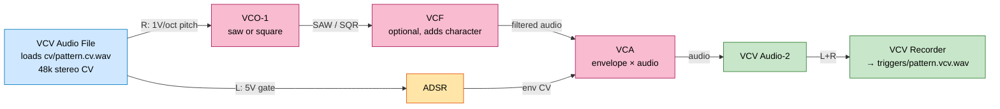

# VCV Rack patch — trigger roundtrip

The trigger-roundtrip harness (`tests/trigger_roundtrip.py`) emits a
stereo CV WAV per test pattern — L channel is a 5 V gate, R channel
is 1 V/oct pitch from C0 = 0 V. VCV Rack plays that WAV as a CV
source, the patch below synthesizes audio, VCV Recorder captures it,
and we feed the resulting audio back through `nd-run` to compare the
extracted voices against the original trigger schedule.

## Patch



Color legend: **blue** = CV input source, **amber** = modulation,
**pink** = audio path, **green** = output/capture.

## Modules

All from the Fundamental + VCV built-in libraries (free, bundled with
Rack):

| Module | Role | Notes |
|---|---|---|
| VCV Audio File | plays `cv/pattern.cv.wav` as stereo CV | right-click → load file |
| Fundamental ADSR | gate → envelope | attack ≤ 10 ms, release ~100 ms works well |
| Fundamental VCO-1 | 1V/oct pitch → waveform | saw gives rich harmonics; square adds odd-only |
| Fundamental VCF | low-pass filter | optional but adds realism; small resonance is fine |
| Fundamental VCA | envelope × audio | the "note on/off" multiplier |
| VCV Audio-2 | output interface | routes to Recorder |
| VCV Recorder | writes rendered audio to WAV | 48 kHz, 32-bit float |

## Running a pattern

1. Load the CV WAV into Audio File (`cv/pattern.cv.wav` — one per
   pattern under `neurodynamics/engine/test_audio/triggers/cv/`)
2. Arm VCV Recorder (choose output folder, WAV 48k float)
3. Press play on Audio File; when playback ends, stop recording
4. Move/rename the rendered file to
   `test_audio/triggers/pattern.vcv.wav`
5. Compare:
   ```
   uv run python -m tests.trigger_roundtrip --compare-vcv pattern
   ```

## Why this is a valid ground truth

Every note in the rendered audio came from a specific gate+pitch
pulse we wrote. The trigger schedule is the expected voice timeline,
1:1. If the engine's extracted voices don't line up with the
triggers, the discrepancy is the engine's — not an artifact of
labeling.

Unlike pure Python synthesis (sum of sines + ADSR), the VCV path
includes real modular-synth broadband content: filter resonance,
VCO saturation, sub-oscillator content, transients at gate
boundaries — the kinds of signals the engine was tuned for.
