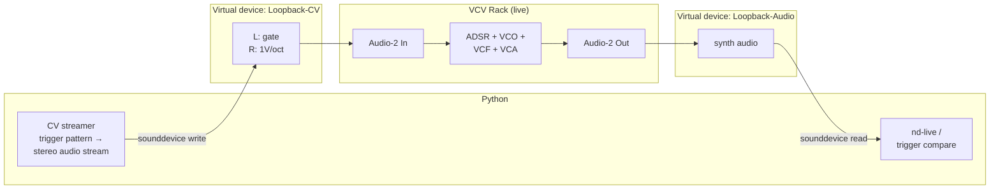
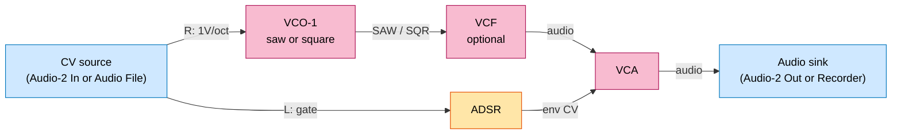

# VCV Rack patch — trigger roundtrip

The trigger-roundtrip harness produces a stereo CV signal (L = 5 V
gate, R = 1 V/oct pitch from C0 = 0 V) that a VCV Rack patch
synthesizes into audio. That audio goes back through `nd-run` and
the detected voices are diffed against the original trigger
schedule — ground truth, no hand labeling.

Two workflows, same synth patch:

- **Live loopback (recommended).** VCV runs as a real-time synth
  between two virtual audio devices. Same architecture the router
  will eventually drive with the physical ES-9.
- **Offline file-based.** VCV loads the CV WAV via an Audio File
  module and renders to a file via VCV Recorder. No loopback setup
  required. Deterministic, reproducible, but not representative of
  the live path.

## Live loopback chain



### Virtual devices (macOS)

Install [BlackHole](https://existential.audio/blackhole/) (free) —
two 2-channel instances, or one 16ch split by channel pairs. In
`Audio MIDI Setup.app`, rename them `Loopback-CV` and
`Loopback-Audio`. Both are DC-coupled by default, which the CV path
needs.

Rogue Amoeba's Loopback app works identically (nicer UI, paid).

### Running

```sh
# Smoke test with one sustained A4
uv run python -m tests.vcv_live_roundtrip \
    --pattern single \
    --cv-device "Loopback-CV" \
    --audio-device "Loopback-Audio"

# Whole suite
uv run python -m tests.vcv_live_roundtrip --pattern all
```

The script writes CV continuously to `Loopback-CV` for the pattern's
duration while capturing from `Loopback-Audio`, saves the captured
audio to `test_audio/triggers/<name>.vcv.wav`, runs `nd-run`, and
prints coverage / phantom-voice / pitch-error metrics.

`--list-devices` dumps all CoreAudio devices if you're not sure what
name to pass.

## The synth patch

Same core in both workflows; only the I/O modules differ.



Modules (all Fundamental + VCV bundled):

| Module | Role | Notes |
|---|---|---|
| VCV Audio-2 (In) | CV input, live mode | set device: `Loopback-CV`, mode: Input |
| VCV Audio File | CV input, offline mode | right-click → load file |
| Fundamental ADSR | gate → envelope | attack ≤ 10 ms, release ~100 ms |
| Fundamental VCO-1 | 1V/oct → waveform | saw for rich harmonics, square for odd-only |
| Fundamental VCF | low-pass filter | optional; small resonance adds realism |
| Fundamental VCA | envelope × audio | gates the note |
| VCV Audio-2 (Out) | audio output, live mode | set device: `Loopback-Audio`, mode: Output |
| VCV Recorder | audio output, offline mode | 48k 32-bit float WAV |

## Offline file-based workflow

```sh
# Write the CV WAVs + print setup instructions
uv run python -m tests.trigger_roundtrip --pattern all --vcv
```

Then in VCV Rack: load `test_audio/triggers/cv/<name>.cv.wav` into
the Audio File module, arm VCV Recorder (output folder of your
choice, 48k float WAV), press play. When playback ends, save the
recorded WAV to `test_audio/triggers/<name>.vcv.wav` and compare:

```sh
uv run python -m tests.trigger_roundtrip --compare-vcv <name>
```

## Why this is a valid ground truth

Every note in the rendered audio came from a specific gate+pitch
pulse we wrote. The trigger schedule IS the expected voice timeline,
1:1. Discrepancies are the engine's — not labeling noise.

Unlike pure Python synthesis (sum of sines + ADSR), the VCV path
includes real modular broadband content: filter resonance, VCO
saturation, transients at gate boundaries, the kinds of signals the
engine was originally tuned against.
